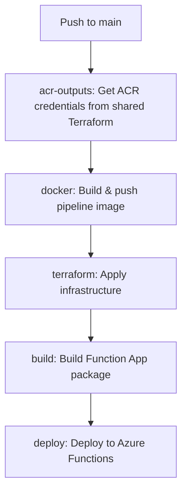

# GitHub Actions Workflows

This directory contains CI/CD workflows for the TV Binge Friend Recommendation Service.

## Workflows

### `deploy.yml`
Main deployment workflow that builds and deploys the recommendation service to Azure. This workflow:
1. Retrieves ACR credentials from shared Terraform state
2. Builds and pushes Docker image for the data pipeline
3. Applies Terraform infrastructure changes
4. Builds and deploys the Azure Function App

**Triggers:**
- Push to `main` branch
- Manual workflow dispatch

## Required GitHub Secrets

The following secrets must be configured in the GitHub repository settings (Settings → Secrets and variables → Actions → Repository secrets):

### Azure Authentication (Federated Identity/OIDC)
| Secret Name | Description | Example |
|------------|-------------|---------|
| `ARM_CLIENT_ID` | Azure service principal application (client) ID | `12345678-1234-1234-1234-123456789abc` |
| `ARM_TENANT_ID` | Azure Active Directory tenant ID | `87654321-4321-4321-4321-cba987654321` |
| `ARM_SUBSCRIPTION_ID` | Azure subscription ID | `abcdef01-2345-6789-abcd-ef0123456789` |

### Shared Terraform State (for ACR Credentials)
| Secret Name | Description | Example |
|------------|-------------|---------|
| `TF_SHARED_RESOURCE_GROUP_NAME` | Resource group containing shared Terraform state storage | `shared-infrastructure-rg` |
| `TF_SHARED_STORAGE_ACCOUNT_NAME` | Storage account name for shared state | `sharedtfstate` |
| `TF_SHARED_CONTAINER_NAME` | Blob container name for shared state | `tfstate` |
| `TF_SHARED_KEY` | State file key/path for shared infrastructure | `shared-infrastructure.tfstate` |

### Service Terraform State (for this service)
| Secret Name | Description | Example |
|------------|-------------|---------|
| `TF_STATE_RG` | Resource group for this service's Terraform state | `tvbingefriend-tfstate-rg` |
| `TF_STATE_SA` | Storage account for this service's state | `tvbftfstate` |
| `TF_STATE_CONTAINER` | Container name for this service's state | `tfstate` |
| `TF_STATE_KEY` | State file key for this service | `recommendation-service.tfstate` |

### Database Configuration
| Secret Name | Description | Example |
|------------|-------------|---------|
| `MYSQL_ADMIN_USERNAME` | MySQL administrator username | `mysqladmin` |
| `MYSQL_ADMIN_PASSWORD` | MySQL administrator password | `(secure password)` |

### Azure DevOps / Artifacts
| Secret Name | Description | Example |
|------------|-------------|---------|
| `AZURE_DEVOPS_PAT` | Personal Access Token for Azure DevOps Artifacts feed | `(PAT token)` |

### Application Configuration
| Secret Name | Description | Example |
|------------|-------------|---------|
| `ALLOWED_ORIGINS` | CORS allowed origins for Function App | `https://example.com,https://app.example.com` |
| `SHOW_SERVICE_URL` | URL of the Show microservice | `https://tvbf-show-service.azurewebsites.net` |
| `IMAGE_NAME` | Docker image name for pipeline container | `recommendation-pipeline` |

### Pipeline Container Configuration (Optional)

These variables have defaults defined in `terraform/variables.tf` and **do not require secrets** unless you want to override the defaults:

| Secret Name | Description | Default Value | Override Example |
|------------|-------------|---------------|------------------|
| `PIPELINE_IMAGE_TAG` | Docker image tag for pipeline container | `latest` | `v1.2.3` |
| `PIPELINE_CPU_CORES` | CPU cores allocated to pipeline container | `2.0` | `4.0` |
| `PIPELINE_MEMORY_IN_GB` | Memory (GB) allocated to pipeline container | `4.0` | `8.0` |

To override these defaults, add the corresponding `TF_VAR_*` entries to the `terraform` job's `env` section in `deploy.yml`:

```yaml
env:
  TF_VAR_pipeline_image_tag: ${{ secrets.PIPELINE_IMAGE_TAG }}
  TF_VAR_pipeline_cpu_cores: ${{ secrets.PIPELINE_CPU_CORES }}
  TF_VAR_pipeline_memory_in_gb: ${{ secrets.PIPELINE_MEMORY_IN_GB }}
```

## Setting Up Federated Identity (OIDC)

To use OIDC authentication with Azure, you need to configure federated credentials for your service principal. **Two credentials are required:**

### 1. Main Branch Credential

1. In Azure Portal, navigate to your App Registration
2. Go to "Certificates & secrets" → "Federated credentials"
3. Add a new credential with:
   - **Federated credential scenario**: GitHub Actions deploying Azure resources
   - **Organization**: Your GitHub organization/username
   - **Repository**: Your repository name
   - **Entity type**: Branch
   - **Based on selection**: `main`
   - **Name**: `github-actions-main`

### 2. Production Environment Credential

1. In the same "Federated credentials" section
2. Add another credential with:
   - **Federated credential scenario**: GitHub Actions deploying Azure resources
   - **Organization**: Your GitHub organization/username
   - **Repository**: Your repository name
   - **Entity type**: Environment
   - **Based on selection**: `production`
   - **Name**: `github-actions-production`

Both credentials are required because the workflow runs on the `main` branch and the `deploy` job uses the `production` environment.

## Terraform Outputs Required

### Shared Terraform Infrastructure
The shared Terraform state must provide these outputs:
- `acr_name` - Azure Container Registry name
- `acr_admin_username` - ACR admin username
- `acr_admin_password` - ACR admin password

### Service Terraform Infrastructure
This service's Terraform configuration must provide:
- `function_app_name` - Name of the Azure Function App
- `function_app_python_version` - Python version for the Function App (e.g., `3.12`)

## Deployment Flow

The workflow runs jobs sequentially to ensure proper dependency management:



This sequential execution ensures that infrastructure is provisioned before deployment and prevents concurrency issues.
